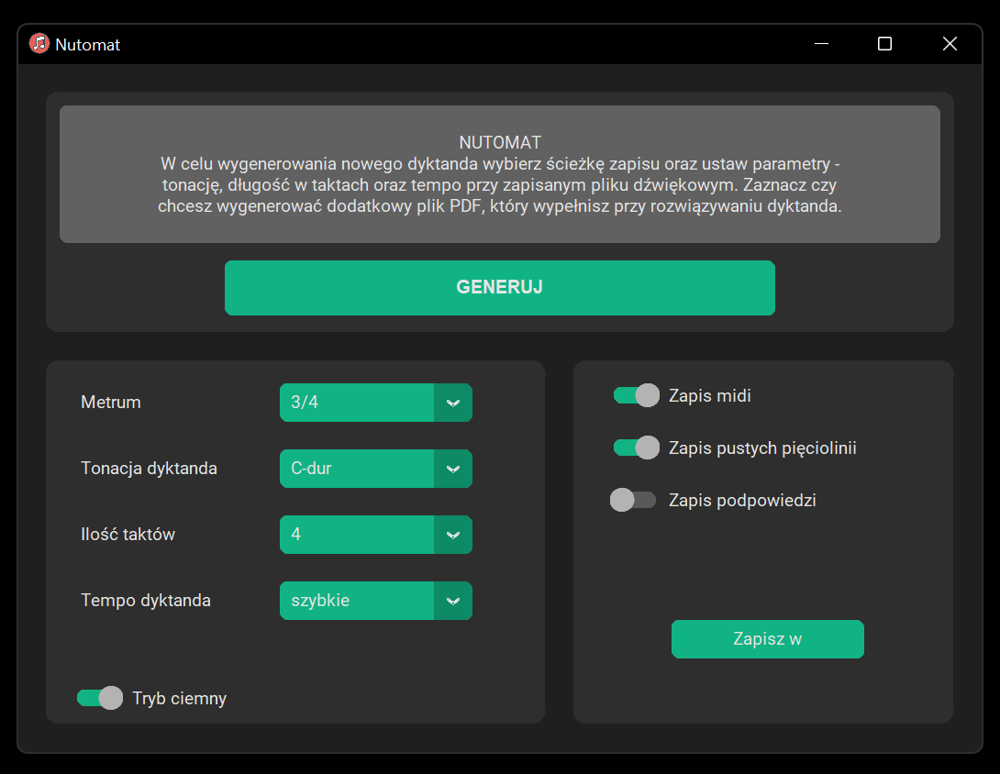
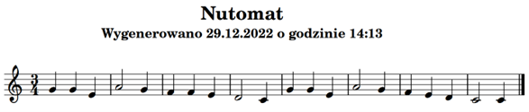
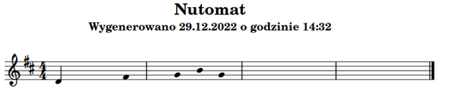

#  Nutomat 🎶

See most recent project-updates at [nutomat.com](https://www.nutomat.com/)

---

This project allows to prepare a neural network which generates new melodies. It uses MIDI files as the training set. Newly generated output can be saved in **PDF** and **MIDI** format. In this project I am using *music21* and *keras* libraries. *LilyPond* is used for creating PDF and MIDI files with generated output. 

The app consists of a user interface that allows for easy interactions. It is possible to change the **length of dictation (in bars**), its **key signature**, the **tempo** of the generated MIDI file and the **path** where the files will be saved.

In the default, the app generates PDF file with the melody using LilyPond. The UI also lets the user to choose whether or not they want to generate MIDI file with the new melody, and a PDF file that would be helpful in using the melody as a musical dictation - empty music staff with only the first note of the melody visible (and some extra visible "hint notes" if the hints toggle is on). 

:bulb: <sub> The code generates a PDF version of the dictation and MIDI version. In the MIDI version, as it is intended to be played *(and possibly later in the project development changed into some actual audio format like WAVE or MP3)*, you will hear an additional candenza - a measure with basic rhythm values specific for this particular time signature. </sub>

## Structure of the project
The code consists of two main parts:
  1. **Preparing the training set and the neural network** - [Przygotowanie_sieci.ipynb](Network_creation_and_training/Przygotowanie_sieci.ipynb). This is a script created with jupyter notebook that prepares MIDI training set files, the network itself, trains the network and saves the output to be later loaded by the UI part of the system.
  2. **User interface** - this part allows to use previously prepared neural network and generate new melodies with it. Consists of a couple of files:
      - [main.py](Nutomat-application/main.py) - starting the app
      - [GUI.py](Nutomat-application/GUI.py) - creating and managing the graphical user interface. The engine part is called in [generate()](GUI.py#L154).
      - [engine.py](Nutomat-application/engine.py) - heart of the app. Used for generating new melodies and saving them into LilyPond, PDF and MIDI files. The generating part happens [here - generate()](Nutomat-application/engine.py#L65) while the saving part [here - save_file()](Nutomat-application/engine.py#L146)
      - [lilypond_utilities.py](Nutomat-application/lilypond_utilities.py) - used mostly for translating music21 music language into LilyPond supported format.

## Running the code
If you want to try out and run this code you will have to download [LilyPond](https://lilypond.org/) and insert the whole folder inside the Nutomat project folder.

The project runs on Python 3.8 or 3.9. Other additional python dependencies are listed in [requirements file](Nutomat-application/requirements.txt):
```
customtkinter==4.6.3
keras==2.11.0
music21==8.1.0
numpy==1.23.5
matplotlib==3.6.2
tensorflow==2.11.0
```

## Executable version
Executable version of the application is available at [here](https://drive.google.com/drive/folders/18bPt_oD5GoS7UUWKG-HuOlzr1gWRSxzS?usp=sharing). There is instruction and demonstration included. If you encounter any problems feel free to contact me.

## Examples
The weights are trained on two training sets - one for 3/4 dictations (307 training files) and second for 4/4 dictations (315 training files).

If you will train your own network and you want to use other model, you will need to update the path in two places in the [engine.py](Nutomat-application/engine.py) - [here](Nutomat-application/engine.py#L27) and [here](Nutomat-application/engine.py#L30). Otherwise you should be free to play with it just running the [main.py](Nutomat-application/main.py).

### User screen


#### Example of a generated dictation


#### Example of a generated dictation - empty with hints



